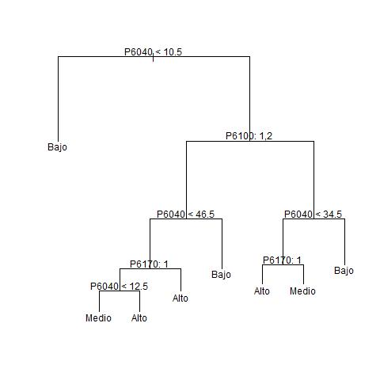

```{r setup, include=FALSE}
knitr::opts_chunk$set(echo = TRUE)
```

## Introducción

*Lo que esta en negrilla es un link que llevará al respectivo documento, para que esto funcione debe descargar primero el pdf*.

En este informe se presenta la solución del equipo Sahlre al Desafio Inversión Educativa. Desafio que consiste en responder: Si tuviera un fondo de 100 millones de dólares ¿Qué inversiones público - privadas priorizaría con el objetivo de garantizar la calidad, pertinencia, equidad e inclusión de la educación en América Latina?

Los datos abiertos relacionados al sector educativo contienen diversas mediciones (variables o características) asociadas a los hogares que podrían dar solución al desafió de inversión educativa en Colombia. Una de ellas es  el nivel educativo de las personas, variable que se convierte en la variable resultado o dependiente que se intentará predecir con las otras características asociadas a cada una de los individuos, como por ejemplo, sólo por mencionar algunas, el género, el material predominante de las paredes exteriores y estado laboral. 

Con dichas características se construyeron diversos algoritmos supervisados para predecir el nivel educativo de las personas: *Uno vs todos Regresión Logistica Multivariada*, *Árbol de clasificación*, *Bagging con árboles de clasificación*, *Boosting con árboles de clasificación* y *Bosques Aleatorios de clasificación*. La decisión de incluir varios algoritmos es poder propener
en esta solución ambos aspectos: predicción e interpretabilidad. Es sabido el *trade off* que existe entre esos aspectos, a mayor capacidad de predicción
de un algoritmo menor será su interpretabilidad. Sin interpretabilidad
es díficil propener solución alguna al desafio de inversión educativa.

##Metodología
Se elegieron las bases de datos del mes de abril de la **[Gran Encuesta Integrada de Hogares (GEIH) - 2017](http://formularios.dane.gov.co/Anda_4_1/index.php/catalog/458)**. Luego con el objetivo de tener una base de datos a nivel nacional con la mayor cantidad de observaciones se seleccionaron las bases de datos: *Características Generales*, *Fuerza de trabajo*, *Otras actividades y ayudas en la semana*, *otros ingresos* y *Vivienda y hogares*, tanto para Areas metropolitanas como para Cabeceras y zonas Rurales. Con cada una de esas bases de datos se procedió a seleccionar aquellas variables con un porcentaje de valores pérdidos inferior al 10%. Tal decisión se toma con la intención de crear un modelo predictivo del nivel educativo que aproveche la mayor cantidad de observaciones de las bases de datos de la GEIH. De esta manera, la propuesta de este análisis de datos no se convierte en una respuesta única a la variación del nivel educativo de los colombianos, sino en una aproximación al mejor modelo predictivo del nivel educativo de los colombianos a partir de la GEIH. El código para cargar y unir las bases de datos está en **[Carga de datos](https://github.com/shlondon/datathon/blob/master/Script/Carga%20y%20preproceso/Carga%20de%20datos.Rmd)**, este produce una base de datos que se ha denominado *bd_Nac.csv*. El nombre de las variables, su significado y los valores asumidos, con su respectiva codificación se puede explorar en **[Definicion de variables](https://github.com/shlondon/datathon/blob/master/Script/Carga%20y%20preproceso/Definicion_Variables.md)**

En la base de datos *bd_Nac.csv* aún hay presencia de valores pérdidos ya que estos no fueron representados a través de un valor vació sino como un valor númerico. Se procede a eliminarlos, además se crea la variables resultado o dependiente sobre la que se intentará realizar la predicción. Se decide transformar la variable P6210 (Nivel educativo mas alto alcanzado) en una variable con tres niveles: Bajo, Medio, Alto.

- El nivel bajo esta conformado por los valores: 1. Ninguno, 2. Preescolar, 3. B?sica primaria, 4. B?sica secundaria. 
- El nivel medio por: 5. Media.
- El nivel alto por: 6. Superior o universitaria.

Este último procedimiento se encuentra soportado en el archivo **[Preproceso de datos 1](https://github.com/shlondon/datathon/blob/master/Script/Carga%20y%20preproceso/Preproceso%20de%20datos%201.Rmd)**. Allí el código produce la base de datos: *bd_Nac_final.csv*

Finalmente en el proceso de construcción de la base de datos sobre la que se realizará el entrenamiento de los algoritmos así como su evaluación de pronóstico, en el archivo **[Datos de entrenamiento y de prueba](https://github.com/shlondon/datathon/blob/master/Script/Carga%20y%20preproceso/Datos%20de%20entrenamiento%20y%20de%20prueba.Rmd)** se encuentra el código que produce las bases de datos de entrenamiento, validación y prueba. La base de datos de entrenamiento *bd_Train.csv* tiene 54397 observaciones y 61 variables, y la base de datos de prueba *bd_Test.csv* tiene 13598 observaciones y 61 variables.

##Predicción del nivel educativo
###Uno vs todos Regresión Logistica Multivariada

*El código para estimar el algorítmo se encuentra en el archivo* **[FSS Uno vs Todos](https://github.com/shlondon/datathon/blob/master/Script/Analisis/FSS_Uno_vs_Todos.R)**

Cómo el nivel educativo, variable dependiente, asume tres niveles: Bajo-Medio-Alto,
la predicción de esta variable no se puede ejecutar a través de la Regresión Logistica Multivariada adecuada para una variable resultado binaria. Este algoritmo consiste en aplicar una regresión logística multivariada por cada nivel asumido en la variable dependiente. De esta manera se estiman tres modelos: el primero con la variable dependiente asumiendo sólo dos valores: "Bajo" y "El resto", el segundo con la variable dependiente: "Medio" y "El resto", y el tercero con: "Alto" y "El resto".

Con el propósito de crear un modelo con mayor nivel de interpretación se utilizó la técnica de selección de variables: Forward Stepwise Selection (FSS).

Los resultados de las primeros 23 modelos se presentan en la siguiente gráfica.

```{r, warning=FALSE, message=FALSE, echo=FALSE,fig.align='center'}
vmm <- c("P5210s16", "P6100", "P6040", "P6240", "P6170", "P4020",
          "Dpto", "P5210s22", "P7505", "P6008", "P6160", "P4030s4",
          "P5090", "P7480s8", "P5210s3",  "P5210s10", "P6020", "P7480s6",
          "P4030s3", "P5210s2", "P5210s9", "P5210s20", "P4010")

pmm <- c(0.5110944, 0.5353788, 0.5431182, 0.5789106,
         0.5926614, 0.6005111, 0.6047392, 0.6126992,
         0.6181591, 0.6216335, 0.6245014, 0.6266522,
         0.6289134, 0.6296855, 0.6312297, 0.6323510,
         0.6351821, 0.6356601, 0.6360829, 0.6366528,
         0.6367998, 0.6375903, 0.6380131)
precValid1 <- c(0.5107429,0.5347336,0.5419951,0.5790840,0.5927569, 0.5996048,0.6049820,0.6124503,0.6177356,0.6210906,0.6238482,0.6267895, 0.6285590,0.6289956,0.6309258,0.6315693,0.6350392,0.6350851, 0.6353839,0.6352460,0.6367167,0.6368086,0.637015)

precValid2 <- c(0.5102604,0.5351702,0.5425006,0.5782108,0.5916998,0.5999265,0.6038330,0.6135074,0.6192752,0.6232277,0.6257555,0.6279155,0.6291105,0.6300526,0.6317761,0.6330400,0.6359354,0.6360273,0.6365558,0.6367167,0.6371533,0.6375210,0.6380955)

precValid3 <- c(0.5123621,0.5357767,0.5413603,0.5788373,0.5923943,0.6000000,0.6033318,0.6121783,0.6186811,0.6217142,0.6236673,0.6261489,0.6276884,0.6285616,0.6307904,0.6317096,0.6351333,0.6353171,0.6354550,0.6351562,0.6371783,0.6371783,0.6376608)

precValid4 <- c(0.5105014,0.5354796,0.5434303,0.5791397,0.5926743,0.6000735,0.6046234,0.6100924,0.6165954,0.6199963,0.6221334,0.6243394, 0.6261087,0.6284066,0.6289352,0.6296245,0.6333471,0.6336458,0.6345190,0.6339446,0.6346339,0.6356910,0.6357829)

precValid5 <- c(0.5116049,0.5357340,0.5455694,0.5784999,0.5940574,0.6017557,0.6049499,0.6130848,0.6187839,0.6213577,0.6249425,0.6272406, 0.6296305,0.6302050,0.6317676,0.6324111,0.6347091,0.6352376,0.6355823,0.6360649,0.6376275,0.6380642,0.6380642)

precValid <- (precValid1 + precValid2 + precValid3 +
        precValid4 + precValid5)/5

errorValid <- 1 - precValid

#Gráfica validation error y training error
df <- data.frame(error = c(1-pmm,errorValid),
                 datos = c(rep("Train",length(pmm)),
                           rep("Valid", length(pmm))),
                 modelos = as.integer(rep(1:length(pmm),2)))
library(ggplot2)
ggplot(df, aes(y=round(error,2), x=modelos, col=datos)) +
        geom_point() +
        geom_line() +
        scale_y_continuous(limits = c(0.0,1))+
        xlab("Cantidad de variables en los modelos")+
        ylab("Error en predicción") +
        geom_hline(yintercept=0.3994889)+
        annotate("text",16,0.42,label="0.3995 Error en predicción con las seis mejores variables",size=2.5)
```

Se observa que a partir de las seis mejores variables el error de predicción tanto para datos de entrenamiento (Train) como para datos de validación (Valid) disminuye lentamente. De esta manera se eligen las primeras seis variables seleccionadas a partir del método FSS que son: P5210s16, P6100, P6040, P6240, P6170, P4020.

Al estimar el modelo con las seis variables se producen los siguientes indicadores:

- Error de clasificación de entrenamiento = 0.3995
- Error de clasificación de prueba = 0.4002

Este modelo es aceptable si se tiene en cuenta que al estimar el modelo con todas (60) las variables los indicadores son:

- Error de clasificación de entrenamiento = 0.3590
- Error de clasificación de prueba = 0.3602

También es importante mencionar que en la gráfica anterior se observa que la línea de error de predicción para datos de validación y datos de entrenamiento se solapan. Esto sugiere que hay alto sesgo. Es decir la hipótesis del algoritmo planteado es muy simple para modelar el nivel educativo. Otra señal de alto sesgo es cuando el error de clasificación es alto y el error de clasificación en datos de entrenamiento y en datos de validación son muy similares.

Resultados que indican varios caminos a seguir si se desea mejorar la predicción:

- Permitir al modelo capturar relaciones no lineales. Esto se lograría a través de interacción entre variables y aumentar el grado de polinomio de aquellas variables que sean continuas.

- Usar algorítmos como las Redes Neuronales, las Máquinas de Soporte Vectorial o Bosques Aleatorios, reconocidos por la capacidad de predicción en escenarios complejos.

- Adicionar nuevas variables.

### Árbol de Clasificación.
*El código para estimar el algorítmo se encuentra en el archivo* **[Tree](https://github.com/shlondon/datathon/blob/master/Script/Analisis/Tree.R)**

Los métodos basados en árboles consisten en segmentar el espacio de variables predictoras (independientes) dentro de un número más simple de regiones. Luego de estimar el árbol de clasificación para las 60 variables predictoras o independientes se obtiene:

- Error de clasificación de entrenamiento = 0.3945
- Error de clasificación de prueba = 0.4029

Con el algortimo Árbol de clasifiacación sucede algo similar al resultado del anterior algoritmo. Los errores de clasificación en datos de entrenamiento y de prueba son altos y similares, lo que indica alto sesgo. De esta manera, para aumentar el nivel de predicción sería necesario utilizar algorítmos que produzcan hipótesis no lineales complejas como lo son las Redes Neuronales, las Maquinas de Soporte Vectorial o los Bosques Aleatorios.


### Bagging en Árboles de clasificación

*El código para estimar el algorítmo se encuentra en el archivo* **[Bagging](https://github.com/shlondon/datathon/blob/master/Script/Analisis/Bagging.R)**

Uno de los problemas más recurrentes de los árboles de decisión es la débil precisión en el pronóstico. El método Bagging o Bootstrap aggregation es un procedimiento para reducir la varianza de los algorítmos supervisados. Luego de estimar el algorítmo con 25 árboles para todas la variables predictoras se obtiene:

- Error de clasificación de entrenamiento = 0.007
- Error de clasificación de prueba = 0.1925

En esta oportunidad se obtienen menor error de predicción tanto en datos de entrenamiento como de prueba. También se presenta una amplia brecha de entre el error de entrenamiento y el error de prueba. Esto indica que el modelo estimado sufre de varianza. Aunque el modelo sufre de alta varianza posee mejor poder de predicción que los anteriores algorítmos estimados. Tal resultado sugiere posibles caminos para mejorar el algorítmo:

- Usar diferente cantidad de árboles al momento de estimar el algorítmo. Si se explora el archivo **[Bagging](https://github.com/shlondon/datathon/blob/master/Script/Analisis/Bagging.R)** la cantidad de árboles utilizado fue 25.

- Utilizar una técnica de selección de variables como Forward Stepwise Selectión, Backward Stepwise Selection o Principal Components Analysis.


### Bosques Aleatorios
*El código para estimar el algorítmo se encuentra en el archivo* **[RandomForest](https://github.com/shlondon/datathon/blob/master/Script/Analisis/RandomForest.R)**

Los Bosques Aleatorios proporcionan una mejora sobre el algorítmo Bagging en Árboles de Clasificación, a través de un ajuste aleatorio que evita la asociación de los árboles creados. Luego de estimar el algorítmo con 25 árboles para todas la variables predictoras se obtiene:

- Error de clasificación de entrenamiento = 0.008
- Error de clasificación de prueba = 0.1958

Los resultados son similares al los obtenidos con el algorítmo Bagging de Árboles de Clasificación. El algorítmo Bosques Aleatorios estimado sufre de varianza aunque tienen mejores resultados en predicción que los tres primeros algoritmos estimados en este estudio. Este resultado sugiere los siguientes caminos para mejorar la capacidad de predicción:

- Usar diferente cantidad de árboles al momento de estimar el algorítmo. Si se explora el archivo **[RandomForest](https://github.com/shlondon/datathon/blob/master/Script/Analisis/RandomForest.R)** la cantidad de árboles utilizado fue 25.

- Utilizar una técnica de selección de variables como Forward Stepwise Selectión, Backward Stepwise Selection o Principal Components Analysis.

###Boosting en Árboles de Clasificación.
La idea del algorítmo Boosting en Árboles de Clasificación es mejorar la poder de predicción de los árboles de clasificación. Es parecido al algorítmo Bagging en Árboles de Clasificación excepto por el método de remuestreo utilizado para estimar los árboles de decisión. Luego de estimar el algorítmo con 25 árboles para todas la variables predictoras se obtiene:

- Error de clasificación de entrenamiento = 0.3602
- Error de clasificación de prueba = 0.3649

Con el algortimo Boosting en Árbols de clasifiacación sucede algo similar al resultado de los dos primeros algorítmos. Los errores de clasificación en datos de entrenamiento y de prueba son altos y similares, lo que indica alto sesgo. De esta manera, para aumentar el nivel de predicción sería necesario utilizar algorítmos que produzcan hipótesis no lineales complejas como lo son las Redes Neuronales, las Maquinas de Soporte Vectorial o los Bosques Aleatorios, reducir el número de varibles a través de métodos de selección de variables o usar otras variables.

##Interpretación de modelos

De los algorítmos estimados *Uno vs todos Regresión Logistica Multivariada* y *Árbol de clasificación* son los de interpretación más sencilla, aunque son los de menor poder de predicción. En cambio aquellos de mayor poder de predicción son de interpretación más díficil debido a la hipótesis complejas sobre las que se fundamentan. Recordar que hay un trade off entre interpretación y nivel decomplejidad de las hipótesis producidas por los algorítmos. Además con la intención de responder al desafió de inversión es necesario identificar la relación entre las variables dependientes con el nivel de educación.

###Interpretación del Árbol de Clasificación

En la figura 1 se observa el Árbol de clasificacion estimado. Tiene 7 nodos internos, 8 nodos términales, y las variables usadas para su construcción son P6040 (Edad), P6100 (¿A cuál de los siguientes regimenes de seguridad social en salud esta afiliado? 1. Contributivo (EPS), 2. Especial (Fuerzas Armadas, Ecopetrol, Universidades Públicas), 3. Subsidiado (EPS-S)) y P6170 (¿Actualmente, asiste al preescolar, escuela, colegio o universidad? 1. Si, 2. No.). La interpretación es de este tipo de algorítmos es muy sencilla:

Nivel bajo

- Personas menores a los 11 años tienen nivel educativo bajo.
- Personas con Régimen de Seguridad Social en Salud (RSSS) subsidiado y mayores a 35 años tienen un nivel educativo bajo.
- Personas con RSSS contributivo o especial y mayores a 47 años tienen nivel educativo bajo.

Nivel medio y alto

- Personas mayores entre los 11 y 35 años con RSSS subsidiado que se encuentran estudiando tienen un nivel educativo alto, aquellos que no están asistiendo a centros educativos tienen un nivel educativo medio.
- Personas con RSSS contributivo o especial entre los 11 y 47 años que no se encuentran estudiando tienen un nivel educativo alto.
- Personas con RRSS contributivo o especial entre los 13 y 47 años que se encuentran estudiando o no estudiando tienen un nivel educativo alto.
- Personas con RSSS contributivo o especial entre los 11 y 13 años que se encuentran estudiando tienen nivel educativo medio.

###Interpretación de Uno vs todos Regresión Logistica

Para facilitar la interpretación del algorítmo se estima con la varible respuesta como una variable binaria donde el valor 1 corresponde a nivel educativo alto y el valor 0 a nivel educativo bajo o medio. Se estima con las seis mejores variables obtenidas a través del proceso Forward Stepwise Selection. Ellas son:

- P5210s16 (¿Hay computador (para uso del hogar)? 1. Si, 2. No.)
- p6100 (¿A cuál de los siguientes regimenes de seguridad social en salud esta afiliado? 1. Contributivo (EPS), 2. Especial (Fuerzas Armadas, Ecopetrol, Universidades Públicas), 3. Subsidiado (EPS-S))
- P6040 (¿Cuántos años cumplidos tiene?)
- P6240 (¿En qué actividad ocupó la mayor parte del tiempo la semana pasada? 1. Trabajando, 2. Buscando trabajo, 3. Estudiando, 4. Oficios del hogar, 5. Incapacitado permanente para trabajar, 6. Otra actividad.)
- P6170 (¿Actualmente, asiste al preescolar, escuela, colegio o universidad? 1. Si, 2. No.)
- P4020 (¿Cuál es el material predominante de los pisos de la vivienda? 1. Tierra, arena, 2. Cemento, gravilla, 3. Madera burda, tabla, tablón, otro vegetal, 4. Baldosín, ladrillo, vinisol, otros materiales sintéticos, 5. Mármol, 6. Madera pulida, 7. Alfombra o tapete de pared a pared.)

```{r, echo=FALSE, warning=FALSE, message=FALSE}
load("RLM.rda")
summary(m3)
```

Todos las variables tienen relación estadísticamente significativa con el nivel educativo. Para interpretar los coeficientes se transforman a posibilidades (odds). 

```{r, echo=FALSE}
d <- summary(m3)$coeff
round(exp(d[,1]),2)
```

- Las personas sin computadora para uso en el hogar (P5210s16) tienen 62% menos de posibilidades de tener nivel educativo alto que aquellos que si la tienen.

- Las personas con Régimen de Seguridad Social en Salud (RSSS) especial (P6100) tienen 1.53 veces más de posibilidades de tener nivel educativo alto que aquellos que tiene RSSS contributivo. Y aquellas personas con RSSS subsidiado tienen 67% menos de posibilidades de tener nivel educativo alto que los que tienen RSSS contributivo.

- A medida que las personas envejecen (P6040) tienen 2% menos de posibilidades de tener un nivel educativo alto.

- Las personas que estaban buscando trabajo la semana pasada (P6240) tienen 68% más de posibilidades de tener nivel educativo alto que aquellos que estuvieron trabajando. Y las personas que ocuparon la mayor parte de la semana pasada en oficios del hogar, incapacitados para trabajar, estudiando u otras actividades tienen menos posibilidades de tener nivel educativo alto que aquellos que estuvierón trabajando.

- Las personas que no están asistiendo actualmente al colegio o universidad (P6170) tienen 90% menos de posibilidades de tener nivel educativo alto que aquellos que están asistiendo.

- Las personas que habitan en viviendas cuyo material predominante de los pisos (P4020) es cemento o madera o baldosín o mármol o madera púlida o alfombra tienen myaor posibilidades de tener nivel educativo alto que aquellos que habitan en viviendas con pisos de tierra o arena.


